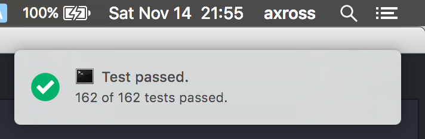
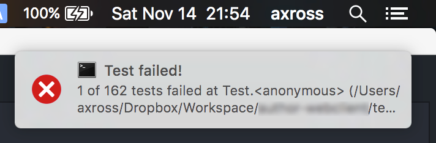

# tap-notify

[](http://badge.fury.io/js/tap-notify)

the Notifier for OS X, Linux and Windows as [TAP reporter](https://github.com/substack/tape#pretty-reporters)





## How to Use

You can use tap-notify in the same way as other [TAP reporters](https://github.com/substack/tape#pretty-reporters). I recommend to use as the first pipe.

```
npm install -g tap-notify
```

```
tape ./*.test.js | tap-notify | tap-diff
```

Or use with `createStream()`:

```javascript
var test = require('tape');
var tapDiff = require('tap-diff');
var tapNotify = require('tap-notify');

test.createStream()
  .pipe(tapNotify())
  .pipe(tapDiff());

process.argv.slice(2).forEach(function (file) {
  require(path.resolve(file));
});
```

## License

MIT
